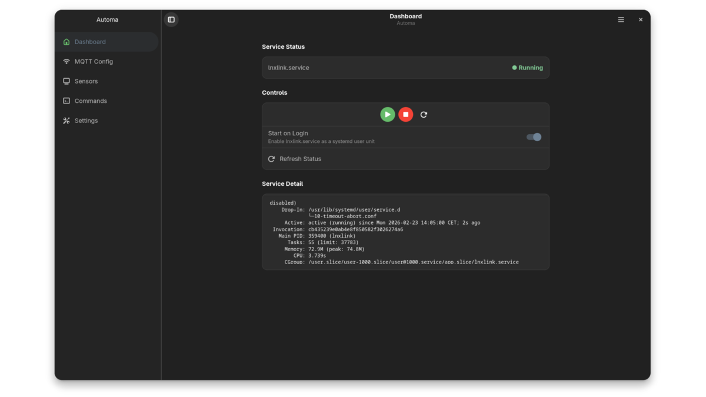
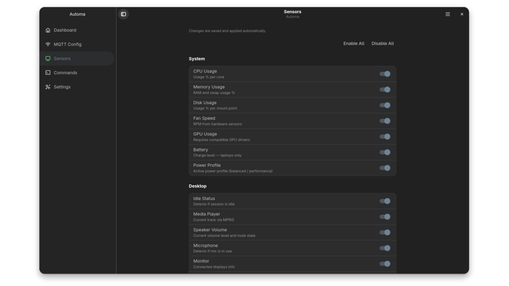
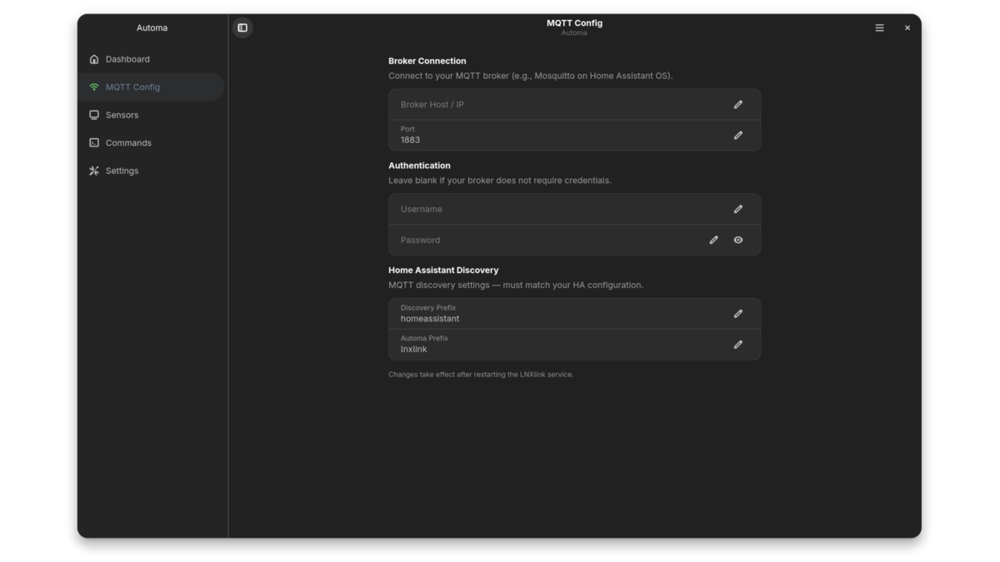

[](LICENSE)
[](https://www.gnome.org/)
[](https://flathub.org)

<div align="center">


# Automa

</div>

Automa is a GTK4/libadwaita control panel for [LNXlink](https://github.com/bkbilly/lnxlink), the MQTT agent that integrates your Linux desktop with [Home Assistant](https://www.home-assistant.io/). No terminal needed — configure everything from a clean GNOME interface.

<div align="center">

</div>

Highlights:

* Start, stop and restart the LNXlink service with a single click
* Configure your MQTT broker connection (host, port, credentials)
* Enable or disable individual sensors — CPU, memory, camera, bluetooth, and more
* Create custom commands triggerable from Home Assistant automations
* Set the device name shown in Home Assistant
* Configure autostart on login for both the app and the service
* Follows GNOME accent color and dark/light theme automatically
* Includes a GNOME Shell extension with a top bar status indicator

## Installation

### From source

Make sure you have the required dependencies:

**Fedora:**
```sh
sudo dnf install python3-gobject gtk4 libadwaita python3-pip
pip install --user ruamel.yaml babel
```

**Ubuntu / Debian:**
```sh
sudo apt install python3-gi python3-gi-cairo gir1.2-gtk-4.0 gir1.2-adw-1 python3-pip
pip install --user ruamel.yaml babel
```

**Arch Linux:**
```sh
sudo pacman -S python-gobject gtk4 libadwaita python-pip
pip install --user ruamel.yaml babel
```

Then clone and run:

```sh
git clone https://github.com/ro2342/automa.git
cd automa
python3 main.py
```

On the first run, the app will detect if LNXlink is installed and offer to install it automatically.

### GNOME Shell Extension

Automa includes a Shell extension that adds a status indicator to the top bar. It shows the service status in real time — green when running, yellow when stopped, red if failed — with quick Start / Stop / Restart controls.

```sh
cp -r gnome-extension/automa@automa.github.io \
      ~/.local/share/gnome-shell/extensions/

gnome-extensions enable automa@automa.github.io
```

On Wayland, log out and back in to activate the extension.

## Screenshots

<div align="center">


</div>

## Contributing

### Translations

Automa uses GNU gettext for translations. Currently available: **English** and **Português (Brasil)**.

To contribute a new language:

```sh
msginit -i locale/automa-gui.pot -l es -o locale/es/LC_MESSAGES/automa-gui.po
# Edit the .po file with your translations
# The app will compile it automatically on the next run
```

Open a pull request with your `.po` file — all contributions are welcome!

### Bugs and feature requests

Please open an issue on [GitHub](https://github.com/ro2342/automa/issues).

## Code of Conduct

Automa follows the [GNOME Code of Conduct](https://conduct.gnome.org/).

## License

Automa is licensed under the [GPL-3.0](LICENSE).
